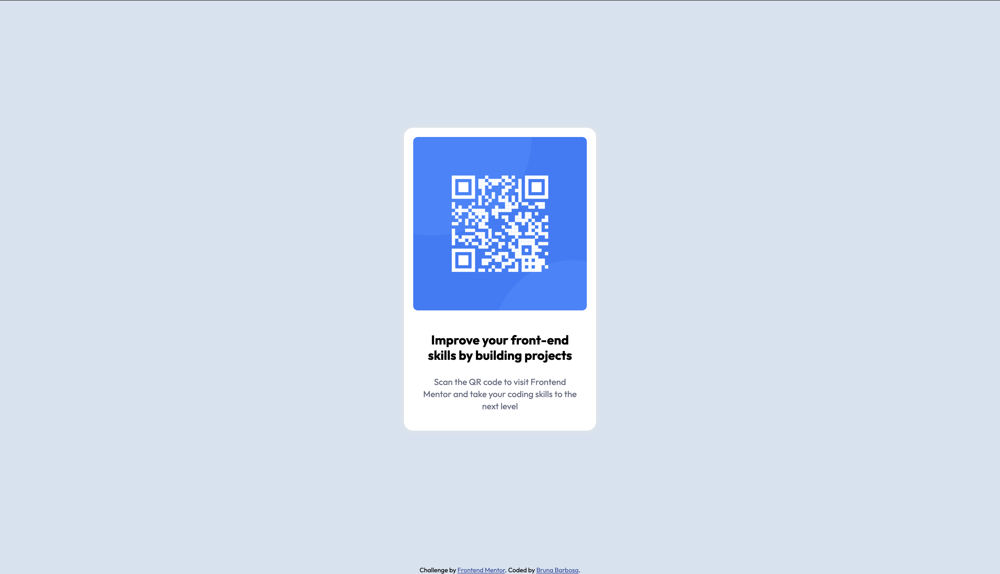

# QR Code Component | Frontend Mentor Challenge

## 🚀 Sobre o projeto

Este é um pequeno componente de QR Code criado como parte de um desafio do [Frontend Mentor](https://www.frontendmentor.io). O objetivo era replicar um design pré-definido com HTML e CSS, garantindo fidelidade visual e boas práticas de código.

## 🛠️ Tecnologias utilizadas

- HTML5
- CSS3
- Flexbox
- Mobile-first design

## 📚 O que aprendi

- Como estruturar um pequeno componente responsivo.
- Ajustar tamanhos de fontes e espaçamentos sem um design em Figma.
- Melhorar a organização do CSS usando boas práticas.

## 🌍 Deploy

O projeto está disponível online! Confira aqui:

[🔗 Link do projeto](https://qr--code-component.vercel.app)

## 💙 Agradecimentos

Desafio fornecido pelo [Frontend Mentor](https://www.frontendmentor.io). Obrigado por proporcionar uma maneira divertida de melhorar minhas habilidades em front-end!

---

🚀 Feito com dedicação por [Bruna Barbosa](https://github.com/brunadbarbosa).

---

# QR Code Component | Frontend Mentor Challenge

## 🚀 About the project

This is a small QR Code component created as part of a [Frontend Mentor](https://www.frontendmentor.io) challenge. The goal was to replicate a predefined design using HTML and CSS, ensuring visual fidelity and good coding practices.

## 🛠️ Technologies used

- HTML5
- CSS3
- Flexbox
- Mobile-first design

## 📚 What I learned

- How to structure a small responsive component.
- Adjusting font sizes and spacing without a Figma design.
- Improving CSS organization using best practices.

## 🌍 Deploy

The project is available online! Check it out here:

[🔗 Project link](https://qr--code-component.vercel.app)

## 💙 Acknowledgments

Challenge provided by [Frontend Mentor](https://www.frontendmentor.io). Thanks for providing a fun way to improve my front-end skills!

---

🚀 Made with dedication by [Bruna Barbosa](https://github.com/brunadbarbosa).
